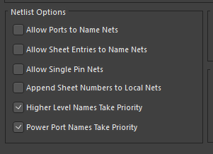

# Electrical Style Guide

Use the following netlist settings under Project Options -> Options:

In PCB layouts, reduce clutter in the silkscreen overlay - clean up repeated component names:
- Click an empty space in the PCB layout
- Open the Properties panel and scroll to the bottom
- Change "Designator Display" from Physical to Logical
