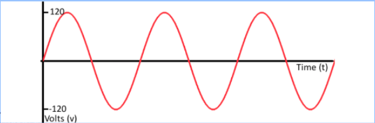
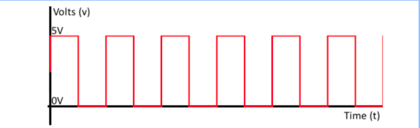

# Analog and Digital Systems

In our satellite we have both analog and digital types of data.

## Analog Data

Analog data can take on any value within some range, usually represented as a voltage (infinite number of possible states).

## Digital Data

Digital data can only take on a "high" or "low" value, usually represented as a "0" or "1" bit (two possible states).

## Conversion

Most data in the real world is analog, but our microcontrollers can only work with digital data.
That is why we generally use Analog to Digital Converters (ADCs) to convert analog inputs to digital forms,
and Digital to Analog Converters (DACs) to convert digital outputs to analog forms.
