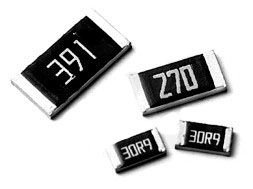

# Components

Here are some of the common electrical components used.

## Header

Headers are used on PCBs to provide an easy interface to connect wires between boards or with a laptop interface.

## Resistor

Resists the flow of electrical current.

| Through Hole | Surface Mount |
| :-: | :-: |
|  |  |

Through hole resistors use colour-coded bands to indicate their value.

## Capacitor

Stores energy in the form of electrical energy. It can store charge and release it when necessary, so it is often used as a *decoupling capacitor* to smooth out fluctuations in a voltage.

## Diode

Only allows current to flow in one direction. If the current flows into the diode in the proper direction, this is called forward biased and ideally behaves as a short circuit. If the current flows into the diode in the opposite direction, this is called reversed biased and ideally behaves as an open circuit.

An LED (light emitting diode) also produces light when forward biased.

## ADC (Analog to Digital Converter)

Converts an analog input signal within a particular voltage range to a digital signal with a specific number of bits. This is used because the microcontroller can only take digital signals as input, so analog inputs must go through an ADC before the microcontroller.

We measure fluorescence and optical density from the samples using sensors whose output goes through an amplifier chain to produce a voltage. This voltage is an analog signal (can be one of an infinite number of values in a range), but we need to convert it to a digital (discrete) format that can be used by the 32M1.

## DAC (Digital to Analog Converter)

Converts a digital input signal with a specific number of bits to an analog output signal within a particular voltage range. This is used because the microcontroller can only output digital signals, so producing an analog output requires it to go through a DAC first.

We use DACs to output reference voltages that control the heater temperature, as well as to output reference voltages for precise optical measurements.

## DC/DC Converters

DC/DC converters, also known as regulators, are a class of switching devices used to change one DC voltage to another, with minimal power loss. They are used to supply loads that require a constant input voltage, and which can be sensitive to changes in the input voltage. The goal of a DC/DC converter is to output a constant voltage, regardless of changes in the input voltage or output current (current drawn by the load). Depending on whether the input voltage is lower or higher than the output (desired) voltage, different types of converters can be used.

The three main types of converters are discussed below. For all converters, there are three important variables: input voltage Vg, output voltage V, and duty ratio D.

### What doesn't work?

Consider the following goal: A sensitive load requires 5 V but you only have a voltage source at 10 V. How would you reduce the voltage to be appropriate for the load?

A possible response would be to use a resistor divider network. Using the equation V = Vin*(R1/(R1+R2)), all you need to do is connect two identical resistors (say, 10 Ω each) in series, and the voltage between them is half of the input. Equivalently, using the load itself as R2 and a resistor equivalent to the load resistance as R1 yields the same result. However, this is hardly a desirable solution when **efficiency** is considered.

In this resistor divider circuit, the source is supplying 10 V at, by Ohm's law, 0.5 A. According to the power equation, P = VI, the source is supplying 5 W of power. Now, the load is being supplied 5 V and draws the same 0.5 A, giving a power draw of 2.5 W. The efficiency is 50%; half of the power from the supply is wasted!

Voltage regulators, on the other hand, are able to perform this voltage conversion with minimal power loss, typically achieving over 90% efficiency.

### Buck Converter

If the output voltage is lower than the input voltage, a simple solution not requiring any switching devices is the voltage divider circuit.

While this circuit might appear to achieve the goal, there is one major drawback: the power delivered to the load is also decreased. This means a 40% reduction in voltage brings a 40% reduction in power, corresponding to an efficiency of 60%.

Buck converters are designed to "buck" down the voltage while maintaining close to 100% efficiency. The schematic of a buck converter is shown below:

#### Key equations

The equation governing the operation of the buck converter is:

