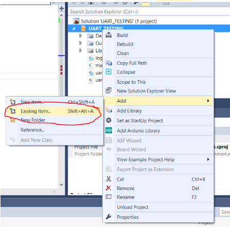
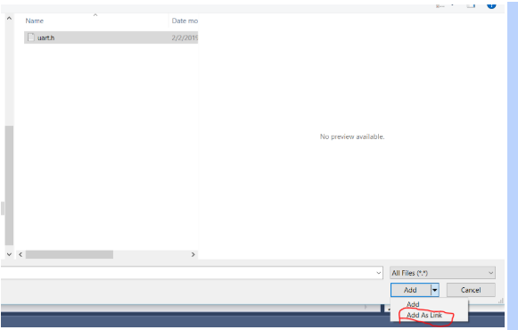

# Debugging Programs Atmel-Studio

Using the Atmel ICE, we can step through and debug programs.

You will need to install 'Atmel Studio':

When programming, you must setup the 'device programming'. It should use the 'debugWire' instead of ISP.

When you are done with you debugging. You should disable the debugWire and close by going to the 'debug' heading.
.
When prompted, toggle the power (remove and reinsert vcc) to set the fuses.

Some notes: You may need to run Atmel Studio as administrator to get programs to compile and build. If the program isn't running as expected, it may be due to compiler optmizations.

Currently, to include other header and source files, you will have to manually link each and every one.

To do this, add each file to the project as a link:

To be continued...
