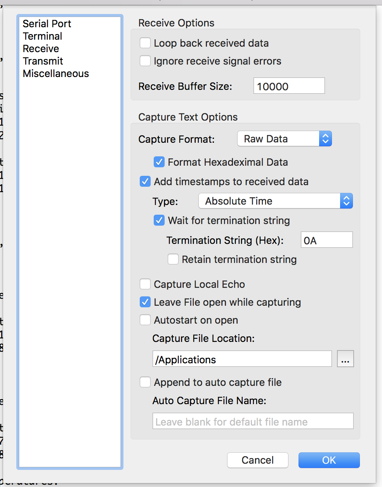
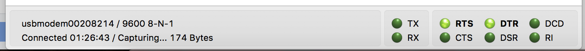
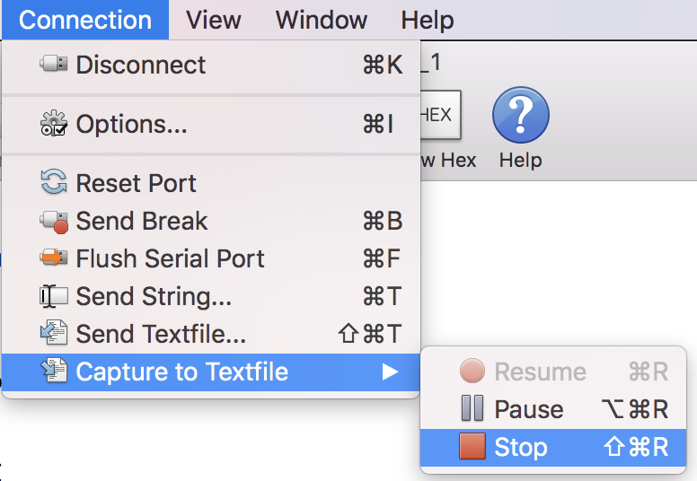
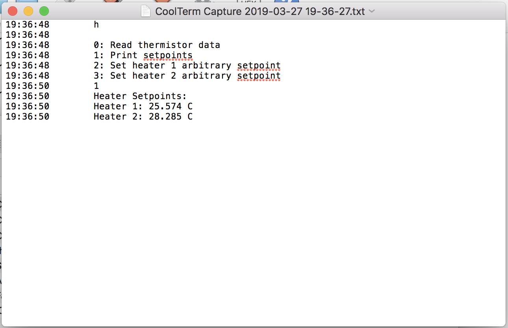

# CoolTerm Capture

You can capture the microcontroller's UART output using CoolTerm and save it to a file.

Open CoolTerm, click Options at the top, then click Receive on the left side. Change the settings as follows (making any modifications as necessary), then click OK.

Click on Connection > Capture to Textfile > Start, and choose the file name and destination to save the data.

Recording is now started. Run the program and collect your data. The bottom of the window should say "Capturing...".

When finished running your program and collecting data, click on Connection > Capture to Textfile > Stop.

Open your file of output data, which should look like this.

