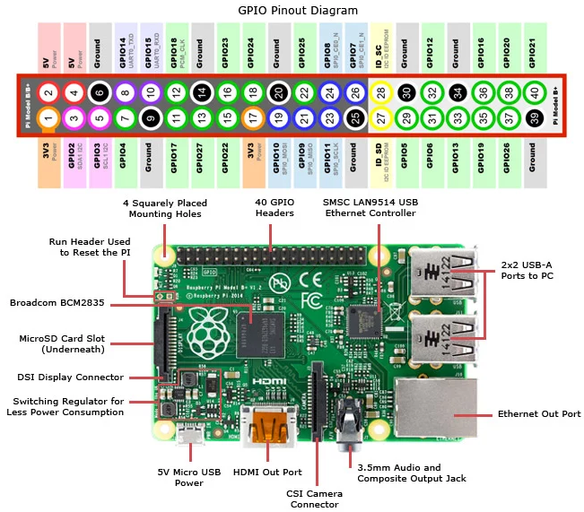

==================
Remote Programming
==================

Introduction
------------

This page describes setup and general best-practices for using a remote programming setup. For connection details and login credentials, please talk to someone from the software team.

Before getting started it's useful to have an uderstanding of basic command line usage and `tmux commands`_. Also, you'll have to ask someone on the Slack what hardware is currently connected or set it up yourself. In the future we may have some standard way of determining current hardware setups.

.. _tmux commands: https://tmuxcheatsheet.com/

Setting up the Hardware
-----------------------
If you require the use of UART TX (i.e. sending serial from your computer to the PCB), then the only hard requirement is that the RXD pin on the microcontroller must be directly accessible through a debugging header. **The standard 4-pin UART header will not work** because the PGM<->RUN mode switch disconnects RXD on the microcontroller during programming. However, since we have direct control over the Raspberry Pi GPIO, we can simply toggle the UART on the Pi before and after programming to get around this issue while developing remotely. Look for "TX" and "RX" labels on your debugging header to see if your board supports it. **Remember to leave the PGM<->RUN mode switch in program mode** to ensure that you can program remotely.

For example, in the case of the OBC PCB, you would use the TX and RX pins on the horizontal header across the south side of the board rather than the 4-pin header in the north-east corner.

Wired Connections
_________________

The Raspberry Pi requires a 5V power supply with at least ~1A of current capability. The official Raspberry Pi foundation recommends 2.5A to ensure that the board always has a steady power source. The Raspberry Pi also needs a wired ethernet connection, but otherwise can be run entirely headless.

We'll be making use of the Pi's GPIO header. An image of the standard 40-pin header used on all Raspberry Pi's is included below for reference.

The Pi will be used to supply 3V3 and UART to the PCB. Connect jumper wires between 3V3 and GND on the Pi and 3V3 and GND on your PCB. In some cases, the inrush current will cause the Pi to restart. We recommend that you first shutdown the Pi safely using :code:`sudo shutdown now` and disconnect the power before changing any of the hardware connections.

While you have the jumpers out, connect UART_TXD (GPIO14) to RX on your PCB and UART_RXD (GPIO15) to TX. This finishes the hardware setup.

Plug back in the Pi and check that it starts up normally. If the red LED on the Pi blinks during startup and seems to power cycle, this is probably *because it's power cycling*. Something on your PCB (or the Pi itself) is drawing too much current during startup and the power adapter you're using doesn't have enough juice to keep the rail up. Disconnect your PCB and see if the issue goes away, or try using a different power adapter.

Getting Your Bearings
---------------------

Log into the remote programming machine over SSH. By default, the user directory should contain a :code:`github` directory. This folder is where you should checkout any GitHub repositories you're developing on.

List out the tmux sessions using :code:`tmux ls` to see if anyone else is currently using your machine. If you get something like :code:`error connecting to ...` then tmux isn't running and you're safe to use the setup. If you do get a list of sessions, get in touch with whoever is using it and see if they're still active.

Start a new session from the command line by calling :code:`tmux new -s <your descriptive session name>` and make sure to include your own name in the title (e.g. :code:`dylan-obc-dev`). This way if someone else logs into the machine (and follows these instructions) they'll see your session and get in touch to see if you're still using it.

While you should read up on available `tmux commands`_, a few basic ones to get you started are:

=========================   ==================================
Ctrl+b %                    Split your tmux pane vertically
Ctrl+b "                    Split your tmux pane horizontally
Ctrl+b o                    Cycle through your active panes
Ctrl+b d                    Detach your current tmux session
Ctrl+b $                    Rename your current session
Ctrl+b [                    Scroll through your terminal history ('q' to exit)
tmux a -t <session name>    Attach to a detached session
=========================   ==================================

Developing on a Remote Machine
------------------------------

Since anyone could have been logged onto the machine before you, make sure to call :code:`git status` and :code:`git pull` to check the current branch and pull any updates. You should ensure you're working on your own branch when on a shared machine. Also, make sure to **commit any work-in-progress** and push it before logging out, lest someone delete your work.

Code development on the remote programming setup is about as you would expect. Write some code, compile it using a call to :code:`make` and upload it to your PCB using :code:`make upload`. Feel free to code in Vim_ for that authentic experience, otherwise VS Code offers an excellent `Remote - SSH`_ extension which allows you to develop on a remote machine from inside VS Code. Just remember to launch up the terminal inside VS Code and perform the same tmux setup as described in `Getting your Bearings`_.

.. _Vim: https://www.fprintf.net/vimCheatSheet.html
.. _Remote - SSH: https://marketplace.visualstudio.com/items?itemName=ms-vscode-remote.remote-ssh

Checking Connected Programmers
______________________________

It's possible to poll connected programmers from the command line using the :code:`pavr2cmd` command. Call :code:`pavr2cmd --help` to get a list of the valid commands. A few useful ones are summarized below:

====================    =================
pavr2cmd -s             Get the status of the connected programmer
pavr2cmd --prog-port    Get the programming port of the connected programmer
====================    =================

UART TX and RX on a Remote Machine
----------------------------------

If you followed `Setting up the Hardware`_, your target board should be connected to the :code:`/dev/serial0` port. This is the UART port mapped to pins 14 and 15 (BCM numbering) of the the Raspberry Pi. There is some setup involved in getting these pins to work as `UART on a Raspberry Pi`_, but this should have already been done on your machine.

.. _UART on a Raspberry Pi: https://www.raspberrypi.org/documentation/configuration/uart.md

If you already have a good understanding of how to use a serial port in Linux, feel free to do it your way. Otherwise, this is the workflow that we recommend.

Getting Started
_______________

This method involves direct reads and writes from the :code:`/dev/serial0` file. Serial configuration is done using the :code:`stty` command line utility. To make life easier, we've added a few macros to :code:`~/.bashrc` to make serial interaction easier.

To begin, call :code:`start_serial` from the command line to set up the :code:`stty` configuration. We also recommend creating a new tmux window or pane and splitting it to view TX and RX at the same time.

UART RX
_______

Just call :code:`cat /dev/serial0` from the command line. This command should block if there's nothing in the serial buffer, and display new lines as they come in. Hit :code:`Ctrl+c` to quit RX.

In case you forget the port, we've also defined the :code:`$serial_port` bash variable. So a call to :code:`cat $serial_port` should have the same effect.

UART TX
_______

We've defined the bash macro :code:`ws <some text here>` to write to the serial port. For example, to send "Hello, World!" over the serial port simply call :code:`ws "Hello, World!"` from the command line.

For context, :code:`ws` is meant to be short for "write serial". The macro is simply calling :code:`echo <some text here> > /dev/serial0` in the background to write to the serial port file.
