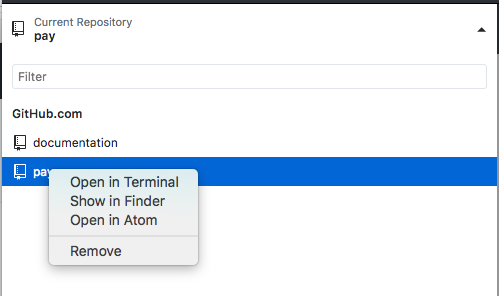
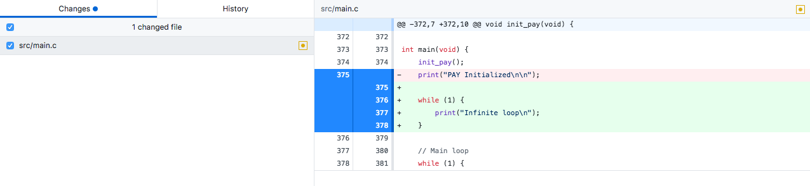

# Software Workflow

This page describes the general workflow to clone a GitHub repository to your computer, make changes to the code, upload them to a board, and push your changes back to GitHub.

Make sure you have already installed everything in Getting Started > Software Installation, created a GitHub account, and are added to the Heron Mk II GitHub organization.

This tutorial will use the `pay` (payload instrumentation) repository as an example, but this process applies to any repository.


## GitHub Repositories

If you go to the UTAT Space Systems organization on GitHub (https://github.com/HeronMkII), you will see a list of repositories. A **repository** is a project with a collection of code for a particular purpose. We have a repository for each of the circuit boards/microcontrollers.


## Cloning a Repository

**Cloning** is the process of copying a repository on GitHub to your computer so you can make changes and push changes back to GitHub.

On the repository page (https://github.com/HeronMkII/pay), click the green button called `Clone or download`, then click `Open in Desktop`. Choose where to save the repository locally on your computer.


## Editing Code

There are two ways to open the project in Atom:

1) Click `Current Repository` in the top left, right-click on `pay`, then click `Open in Atom`.



2) Open Atom, go to `File > Open`, navigate to where you saved the repository locally, and select the `pay` folder.

You can now pen and edit files in Atom. Atom is a text editor, so it can edit code but it can't run it. We need to use command line tools to compile and upload code to the board. Make sure to save your edited files in Atom before compiling and uploading the program.


## Project Structure

When opening the repository folder in Atom, you will see many folders and files.

Here are the commonly used folders.

- **.git**: Not actually part of the project, so ignore it. It contains files that Git uses for version control.
- **build**: Compiled versions of the files.
- **examples**: Example code that demonstrates use of particular software components. This is not the actual code that will go on the satellite.
- **lib-common**: This is a Git **submodule**, which has code from another repository embedded in this repository so that we can use it. Our `lib-common` repository contains common code to be shared among all the repositories.
- **src**: The actual code that will go on the satellite (`.c` and `.h` files).
- **tests**: Automated testing files that will be used by the test harness.

`lib-common` has a slightly different structure:
- **bin**: For the automated test harness (`harness.py`).
- **include**: All the `.h` files.
- **lib**: Compiled versions of the common libraries.
- **src**: All the `.c` files (the `.h` files are moved to `include`).

Here are the commonly used files.

- **.gitignore**: Specifies which files Git should ignore (not saved to the GitHub repository).
- **.gitmodules**: Contains information about the Git submodule used in this repository.
- **makefile**: Contains instructions that Make will use to compile the project.
- **README.md**: Documentation about this repository.


## Compiling and Uploading a Program

We need to compile the project from the command line. Open your command line (Terminal on Mac or Command Prompt on Windows) and navigate to the `pay` folder.

```
$ cd <folder>/<other folder>/.../pay
```

Make sure `lib-common` is up to date:

```
$ git submodule update --remote
```

We need to compile `lib-common` separately from the `pay` project.

```
$ cd lib-common
$ make
```

When you run `make`, the Make tool looks inside the folder for a `makefile` and executes the instructions in it to compile `lib-common`.

Go back (up) one folder:

```
$ cd ..
```

Now compile the `pay` project.

```
$ make
```

If you are connected to the board, upload the program to the 32M1.

```
$ make upload
```

If you get an error about the device not being found, see the `Finding the Correct USB Port` section below.

Note for future reference that you can use `make upload` to both compile and upload the program.

If there are any compilation errors, fix them in Atom, save the files, and run `make` again.

Note: If you get errors about C99, go to the makefile and add `-std=c99` to the CFLAGs. Ask a lead if you are not sure.


## Finding the Correct USB Port

If you get an error about the device not being found, you need to change the port used to communicate with the device. In Atom, open the `makefile` in the `pay` folder. Find the line starting with `PORT =`. Find the port on your computer as shown below, modify this line, save the file, and run `make upload` again.

**Mac**: To see all connected USB devices, run

```
$ ls /dev/tty.usb*
```

The USB device corresponding to the programmer is almost always the device
with the lowest id. In the makefile, change the value of `PORT` to this device's
location. For example, if the `ls` command
above displays `/dev/tty.usbmodem00100561` and `/dev/tty.usbmodem00100563`,
set `PORT = /dev/tty.usbmodem00100561`.

**Windows**: Open the `Device Manager` application on your computer, then select `Ports`. Find the appropriate port. You want the programmer port, not the serial port. In the makefile, modify the line to use the programming port, such as ```PORT = COM7```.


## Committing and Pushing to GitHub

After making changes to the code and running it, you will probably need to modify, compile, upload, and test it a few times. Remember to save the files in Atom and run `make upload` to compile and upload it each time.

When you are ready to save your changes to GitHub, go to the GitHub Desktop application. It will show which lines in which files you have changed. Red lines have been deleted and green lines have been added. Review these changes to be sure.



Now, we will create a commit. A **commit** is a version of the project where you have made a particular set of changes. In the `Summary` box, type a summary of the changes you made. In some cases, you may want to add a more detailed description. Click the `Commit` button to make your commit. Push it to GitHub by clicking the `Push Origin` button in the top right. Now your commit is saved on GitHub.


## Branches and Pull Requests

A **branch** is like a timeline of development within a repository. We have a **master** branch that always contains a version of the code that has been tested and that we know works.

**Never commit directly to the master branch** (except for rare cases when one of the leads tells you otherwise). We create separate branches to develop and test code, then integrate those changes into master when we know they work.

To create a new branch on the GitHub repository page or in GitHub Desktop, select the *base* branch from which to create the new branch. Go back to the list of branches, type in a name for the new branch, and create it. When editing and committing code on this new branch, make sure you have that branch selected in GitHub Desktop.

When you want to integrate your commits on this branch into the master branch, create a **pull request**. Go to the GitHub repository page, click `New pull request`, choose the base (master) and the compare (your branch). Add a description and people to review it (usually your subsystem lead). If they approve your pull request, they will **merge** it into the master branch, integrating those commits into master.
