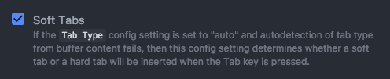
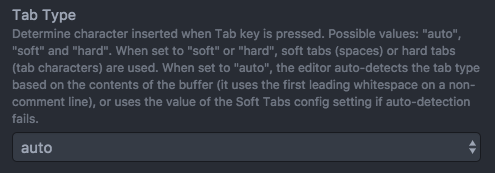

# Programming Style Guide

This is a collection of the software programming style guide for the Heron Mk II codebase. Feel free to suggest revisions or new guidelines.


## Memory Allocation and `malloc()`

**You are not allowed to use `malloc()`.** This is because our satellite is an embedded system and `malloc()` is a non-deterministic operation.

- There is a limited amount of memory, so it is likely to fail.
- It may be very slow, blocking the system.

**All arrays must be statically declared with a fixed number of elements**, preferably using a named constant that can be easily changed.


## Integer Types

**Avoid using the `int` type.** All integer types should be declared with explicit sizes using types in the `<stdint.h>` library, such as `uint8_t`, `uint32_t`, and `int16_t`.

**Be careful about integer sizes.** We need to avoid integer overflows at all costs, so make sure your integer types are large enough for the values they will contain.


## Infinite Loops and Timeouts

**Do not allow the possibility of an infinite loop.** Do not assume hardware will always behave as expected. Always add a timer as a fallback for loops waiting for a hardware event so the MCU cannot get stuck in an infinite loop.

The most common timeout value is (2^16 - 1) or 65,535 with a `uint16_t` type counting down to 0.

For example, say we are waiting for the pin PB0 to go low before proceeding.

```C
// bad, could infinte loop
while (bit_is_set(PINB, PB0)) {
    continue;
}

// good, protect against rare case of infinite loop
for (uint16_t timeout = 65535; bit_is_set(PINB, PB0) && timeout > 0; timeout--) {
    continue;
}
// might want to check if timeout == 0 here if you want to detect a timeout
```


## Compiler Warnings

**Generally, you should not have any compiler warnings.** These often detect non-obvious bugs such as integer overflows.


## Header File Guards

All header files (`.h`) should have a guard statement to prevent duplicate declarations when included multiple times.

Say we have a header file called `file.h`:

```C
#ifndef FILE_H
#define FILE_H

<code>

#endif
```


## Spaces

All code is formatted with **spaces, not tabs**, using **4 spaces** to represent an indent.

If you are using Atom, this is done as follows: in the menu bar, select `Atom > Preferences`, select the `Editor` tab, and change the settings as follows:







## Naming

Variables, functions, and types are named using the "snake case" convention, where all letters are lowercase and all "words" are separated with underscores.

```C
// bad
void dosomethingnow() {
}

// bad
void DoSomethingNow() {
}

// bad
void Do_Something_Now() {
}

// good
void do_something_now() {
}
```


## Operator Spacing

There should be a space on each side of a binary operator (operates on two values) or a ternary operator (operates on three values).

```C
// bad
a=b+c;
x=a?b:c;
if (thing1&&thing2) {
}
for (int i=0; i<5; i++) {
}

// good
a = b + c;
x = a ? b : c;
if (thing1 && thing2) {
}
for (int i = 0; i < 5; i++) {
}
```


For unary operators (operates on one value), there should be a space opposite the value but no space beside the value.

```C
// bad
if (! enable) {
    x = ~ x;
    i ++;
}

// good
if (!enable) {
    x = ~x;
    i++;
}
```


## Punctuation Spacing

There should be a space after commas and semicolons (except semicolons that end a line).

```C
// bad
my_func(a,b,c);
for (int i = 0;i < 5;i++) {
}

// good
my_func(a, b, c);
for (int i = 0; i < 5; i++) {
}
```


## Functions

Functions that do not take any parameters should have `void` in the parentheses.

```C
// bad
int main() {
    ...
}

// good
int main(void) {
    ...
}
```


## Parentheses

If statements, while loops, functions, structs, etc. should have the first curly brace on the same line as the declaration, not the following line. There should be a space between the closing parenthesis and the opening curly brace.

```C
// bad
int main(void)
{
    ...
}

//  bad
int main(void){
    ...
}

// good
int main(void) {
    ...
}
```

```C
// bad
if (condition){
    ...
}

// good
if (condition) {
    ...
}
```
