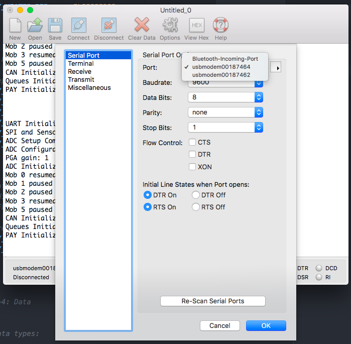
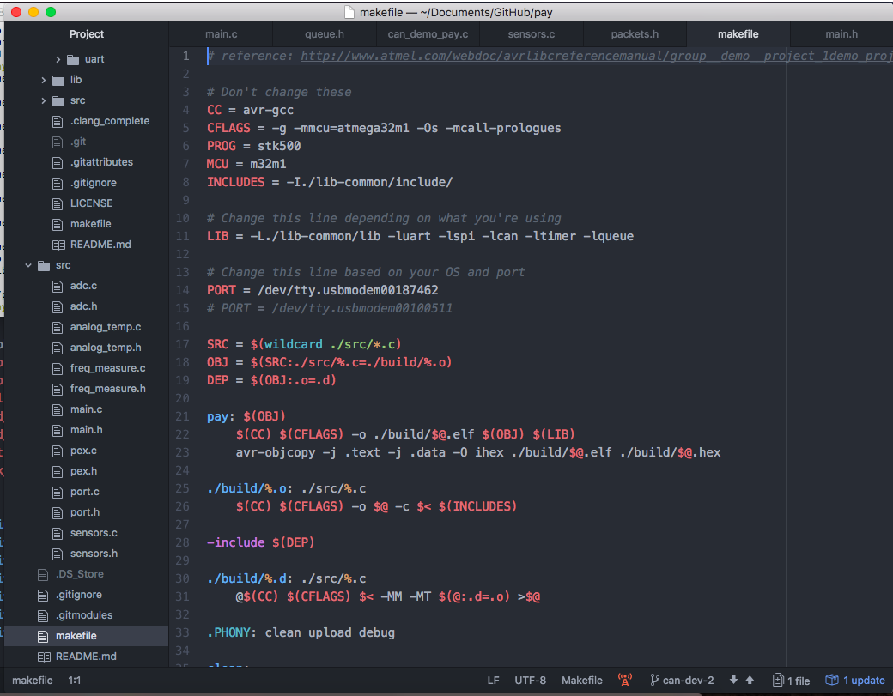

# Troubleshooting

This document is to be used as a guide when programming to ensure all critical points for error are considered.

Below is a quick checklist for points to consider when programming.

- [ ] Lib-common, if included, is compiled.
- [ ] Added files compile.
- [ ] 'PORT' in makefile is set to the correct port. See below for details.
- [ ] All necessary lib-common modules are initialized.
- [ ] Build folder is included.
- [ ] CoolTerm / Xterm baud rate is set to 9600. Appropriate port is set. See below for details.
- [ ] 6-pin programming header is connected to the PCB.
- [ ] If using CAN, the CANH and CANL pins are connected between PCBs.

If the quick checklist has not cornered your error, let us first troubleshoot the software.

**Hardware**

### Is the LED on the board on?

- [ ] Check power supply, use different channel
- [ ] Change wires

### Is UART working? Can you see your print statements on CoolTerm / Xterm?

- [ ] Check that you have clicked on the Connect button
- [ ] Click on the Options button and ensure your port is correct. This port should not be the same as the port in your makefile.
- [ ] Check the baud rate (use 9800)
- [ ] Ensure the UART wire is connected to MOSI pin on the board and to the RX pin on the Pololu programmer (Figure X)

**Software**

**Read compiler warnings**

### Does AVR say completed and uploaded to board?

- [ ] Check your port on the makefile. (For macOS use ls /dev/tty. \*), for Windows use device manager)
- [ ] Change programmer micro-usb
- [ ] Change programmer
- [ ] Change PCB

### Debugging through print statements (like the old times)
- [ ] Add a print statement after init_uart() to see if your program executes on the board
- [ ] Use various print statements throughout the program to see how your program executes (print useful variables)

### Appendix

## Figure 1

